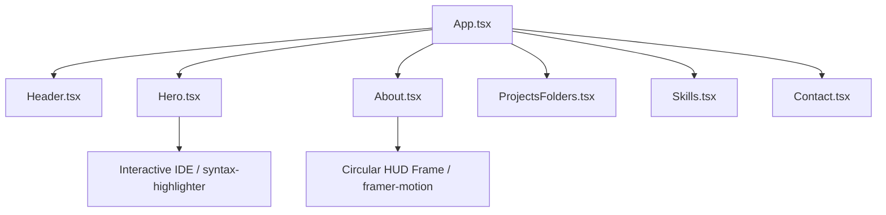

# Specification: Hero Redesign (Interactive IDE) & HUD Circular Profile Frame

This specification details the implementation of a new "About Me" section (with a circular HUD profile picture frame), a complete redesign of the Hero section into an Interactive Code IDE widget, and contact form integration using Web3Forms.

## 1. Goal & Requirements
1. **Hero Section Redesign (Interactive IDE)**:
   - Left Column: Welcoming bio introduction with high-fidelity typography, a custom tag prompt `ralph@workspace:~$ init`, and clean Call-To-Action buttons.
   - Right Column: An interactive, theme-adaptive code editor panel. Users can click tabs (`Profile.json`, `Capabilities.ts`, `Pipeline.go`) to dynamically render syntax-colored code blocks representing Ralph's background.
2. **About Me Section**: Added below the Hero section.
   - Summarizes Ralph's IT degree from Saint Columban College and Fullstack focus.
3. **HUD Circular Profile Frame**: 
   - Positioned on the right side of the About Me grid.
   - The portrait image is fully circular (`border-radius: 50%`).
   - Framed by concentric rotating dashed/dotted circles, target brackets, coordinate overlays, and a looping visual scanner.
   - Performs a 3D-tilt coordinate offset based on mouse movements.
4. **Direct Form Submission (Web3Forms)**:
   - Submit form entries asynchronously to `https://api.web3forms.com/submit`.
   - Manage loading, success, and error indicators.

---

## 2. Architecture & Components



### Components List
*   **[MODIFY]** `src/components/Hero.tsx`:
    - Updated layout to a split grid with text on the left and the Interactive IDE panel on the right.
    - Manages state for the active IDE tab ('json' | 'ts' | 'go') and handles dynamic switching animations.
*   **[MODIFY]** `src/components/About.tsx`:
    - Adjusted layout grid.
    - Redesigned the portrait wrapper into a circular HUD layout with spinning overlays (`outer-ring`, `middle-ring`, `inner-ring`, crosshairs, coordinate displays, and scanline overlay).
*   **[MODIFY]** `src/App.tsx`:
    - Mounted `<About />` below `<Hero />`.
*   **[MODIFY]** `src/components/Header.tsx`:
    - Added nav links to `#about`.
*   **[MODIFY]** `src/components/Contact.tsx`:
    - Web3Forms API submission.
*   **[MODIFY]** `src/index.css`:
    - Added styles for the interactive IDE (editor windows, tabs, file icons, and code line numbers).
    - Added styles for HUD concentric circles, target crosshairs, and scanline keyframe sweeps.

---

## 3. IDE Code Tabs Content

### Tab 1: `Profile.json`
```json
{
  "name": "Ralph Ouano",
  "role": "Fullstack Engineer",
  "degree": "BSIT",
  "almaMater": "Saint Columban College",
  "status": "Ready to build"
}
```

### Tab 2: `Capabilities.ts`
```typescript
interface Developer {
  frontend: string[];
  backend: string[];
}

const ralph: Developer = {
  frontend: ["React", "TypeScript", "TailwindCSS"],
  backend: ["Laravel", "NodeJS", "Go", "Postgres"]
};
```

### Tab 3: `Pipeline.go`
```go
package main

import "fmt"

func ProcessRequest(req string) {
    fmt.Printf("Ingested telemetry packet: %s\n", req)
    // Synchronize queue, caching via Redis ring-buffers
}
```

---

## 4. Verification & Testing

### Verification Checklist
1. **Tab Switching**: Verify that clicking IDE tabs in the Hero section swaps the code content with a smooth transition.
2. **Rotating Circles**: Hover over the profile image. Confirm that concentric circles rotate in opposite directions.
3. **Scanline Animation**: Verify that a horizontal glowing scanning bar sweeps vertically down the circular portrait.
4. **Responsive Layout**: Shrink the viewport to mobile width and verify that the IDE elements and circular HUD frame scale cleanly without clipping.
